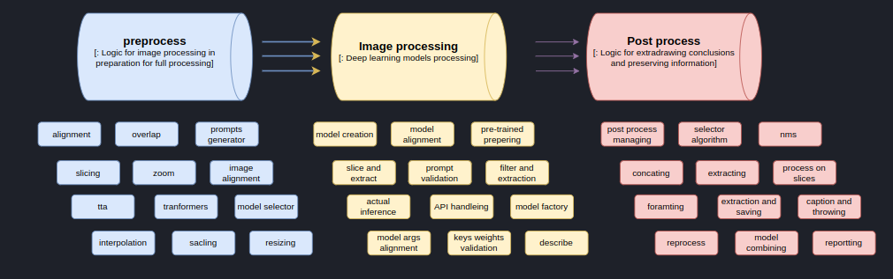

# Developer Guide: System Architecture

## Introduction

The **UniversaLabeler** project is designed to create an abstraction layer between different deep learning models and standardize the workflow for processing images. This document outlines the core system architecture, its design motivations, and its implementation details.

## Motivation

As described in the main documentation, **UniversaLabeler** aims to provide a structured, modular approach to image processing. The key motivation behind this architecture is to:

- Standardize interactions between different models.
- Create an intuitive, high-level API for users.
- Enable easy expansion and integration of new models.
- Separate concerns via well-defined abstraction layers.

Below is a **high-level flow diagram** illustrating the system’s core components and their interactions.


## Core Architecture

The architecture follows a layered design, where each component plays a distinct role:

### Universal Labeler (UL)
#### Goal
The **UL layer** provides a high-level API that abstracts away the underlying complexity of different models. It serves as the entry point for users and handles the orchestration of various processing tasks.

#### Behavior
Each UL implementation (e.g., `ULDetection`, `ULSegmentation`) extends a base `universal_labeler.py` class, ensuring a standardized workflow. These classes:

1. **Initialize with required parameters**
2. **Invoke the correct Factory Interface** to load models
3. **Preprocess the input image**
4. **Run the models with user-defined configurations**
5. **Perform post-processing (e.g., NMS, result filtering)**
6. **Return structured output**

Example classes:
- `ul_detection.py` (for object detection tasks)
- `ul_segmentation.py` (for segmentation tasks)

Remember the flow


---

### Factory Interface (Model Factory)
#### Goal
The **Factory Interface** acts as an intermediary between the UL layer and the actual models. Instead of each UL class manually loading models, it simply requests them from the factory, ensuring modularity and flexibility.

#### Behavior
The **Factory Interface** is implemented through:
- `factory_detection_interface.py`
- `factory_segmentation_interface.py`
- `factory_image_caption.py`

Each factory implementation must adhere to a common interface (`factory_model_interface.py`) and expose methods such as:

```python
@abstractmethod
def create_model(self, model_type: str) -> BaseModel:
    """
    Create and return a model instance based on the model_type.
    """

@abstractmethod
def available_models(self) -> list:
    """
    Return a list of available model types.
    """
```

This design allows us to dynamically register and initialize new models without modifying the UL layer.


---

### BaseModel & Models
#### Goal
The **BaseModel** interface ensures that all models, regardless of their type, provide a consistent API for inference.

#### Behavior
- `BaseModel` defines common behavior across all models.
- `BaseDetectionModel`, `BaseSegmentationModel`, and `BaseImageCaptionModel` extend `BaseModel` and add task-specific functionality.

For example, detection models expose:
```python
@abstractmethod
def get_bboxes(self, image: np.ndarray) -> List[Dict]:
    """
    Return bounding boxes for detected objects.
    """
```
Whereas segmentation models expose:
```python
@abstractmethod
def get_masks(self, image: np.ndarray) -> np.ndarray:
    """
    Return segmentation masks for detected objects.
    """
```

All model implementations inherit from these base classes, ensuring standardization.


---

## Post-Processing Components

### NMSHandler
The **NMSHandler** is responsible for merging overlapping detection results and prioritizing the most confident predictions. It combines results from multiple models based on user-defined preferences and known model characteristics.

- Integrates **class priorities** to resolve conflicting classifications.
- Uses **model confidence scores** to eliminate redundant detections.
- Outputs a **single refined detection result.**


---

### SegSelector
The **SegSelector** module handles post-processing for segmentation tasks, merging masks from different models while considering priority rules.

- Works similarly to NMS but operates at the pixel level.
- Resolves segmentation conflicts between different models.
- Allows user-defined weighting of different segmentation models.


---

## Summary
By leveraging this structured, modular architecture, **UniversaLabeler** provides a scalable and extensible framework for working with multiple AI-based image processing tasks. Developers can easily integrate new models, modify processing pipelines, and extend the system without disrupting existing functionality.

Next Steps:
- [Model Integration](model-integration.md) – Learn how to add new models to UniversaLabeler.
- **[Advanced pipelines](advanced-usage-pipelines.md)** – Create pipelines with custom configurations.

